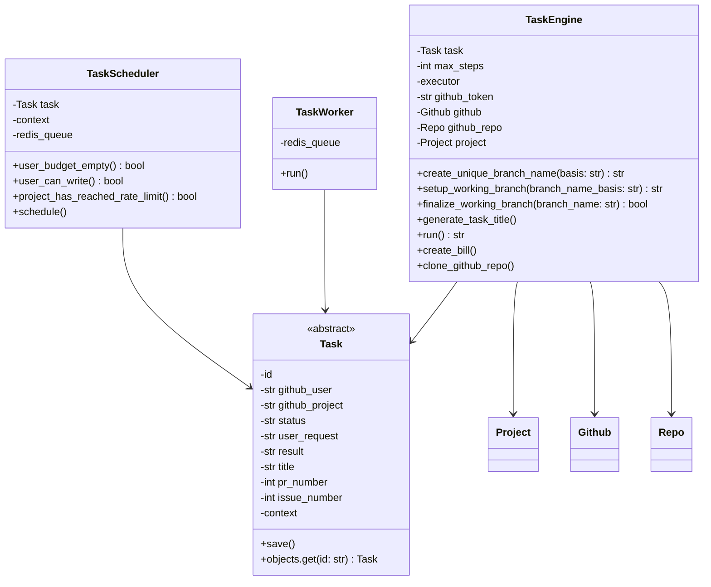
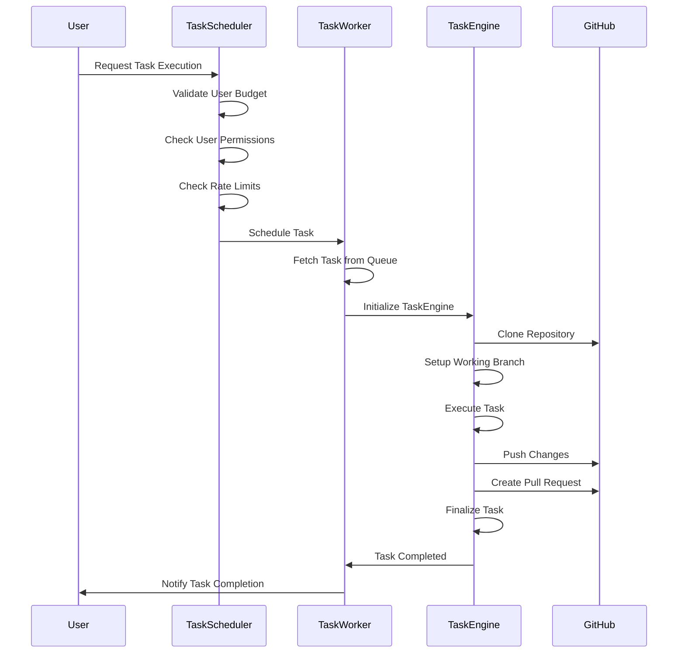

# Task Processing in PR Pilot

The lifecycle of a task within PR Pilot involves several key components: `TaskEngine`, `TaskScheduler`, and `TaskWorker`.

## Domain Model

Based on the provided files, here is the Mermaid class diagram illustrating the domain model of the task processing in PR Pilot:

### Description
The task processing in PR Pilot involves three main classes: `TaskEngine`, `TaskScheduler`, and `TaskWorker`.

1. **TaskEngine**: This class is responsible for executing the tasks. It handles the setup of the working branch, finalizes the branch, generates task titles, runs the task, creates bills, and clones the GitHub repository. It interacts with the `Task`, `Project`, `Github`, and `Repo` classes.

2. **TaskScheduler**: This class schedules tasks for execution. It checks if the user has enough budget, if the user has write access to the repository, and if the project has reached its rate limit. Depending on the job strategy, it either runs the task in a background thread, a Kubernetes job, logs the task, or schedules it via Redis.

3. **TaskWorker**: This class continuously listens for tasks in the Redis queue and processes them using the `TaskEngine`.

4. **Task**: This is an abstract representation of a task. It contains attributes like `id`, `github_user`, `github_project`, `status`, `user_request`, `result`, `title`, `pr_number`, `issue_number`, and `context`. It also has methods to save the task and retrieve a task by its ID.

The `TaskEngine`, `TaskScheduler`, and `TaskWorker` classes all interact with the `Task` class to perform their respective functions.

## Task Lifecycle

### Mermaid Sequence Diagram

### Description

1. **User Request**: The user initiates a task execution request.
2. **TaskScheduler**:
   - Validates the user's budget.
   - Checks if the user has the necessary permissions.
   - Ensures the project has not reached its rate limit.
   - Schedules the task for execution.
3. **TaskWorker**:
   - Fetches the task from the queue.
   - Initializes the `TaskEngine` to handle the task.
4. **TaskEngine**:
   - Clones the GitHub repository.
   - Sets up a working branch.
   - Executes the task using the provided user request.
   - Pushes any changes to the repository.
   - Creates a pull request if necessary.
   - Finalizes the task and updates its status.
5. **Completion**:
   - The `TaskWorker` notifies the user of the task's completion.

This sequence diagram and description illustrate the interaction between the components to execute a task in the PR Pilot system.
